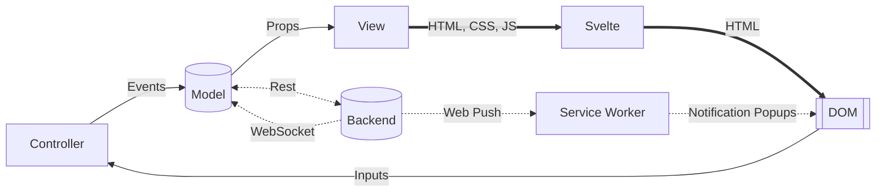

# Frontend

## Architecture

```mermaid
flowchart LR
    Controller --Events--> Model[(Model)]
    Model <-.Rest.-> Backend[(Backend)]
    Backend -.WebSocket.-> Model
    Model --Props--> View
    View ==HTML, CSS, JS==> Svelte
    Svelte ==HTML==> DOM[[DOM]]
    DOM --Inputs--> Controller
    Backend -.Web Push.-> Worker[Service Worker]
    Worker -.Notification Popups.-> DOM
```

## Instructions

See [`../README.md`](../README.md) for instructions.